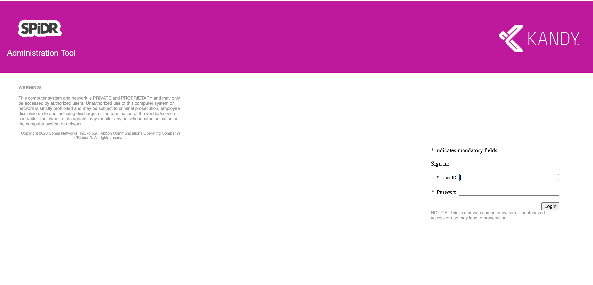
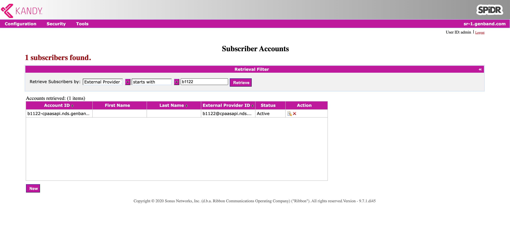
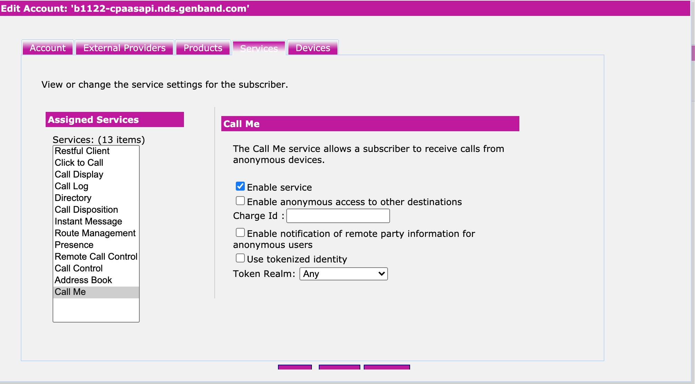

# Enabling Anonymous Call Service

When an application wants to make an anonymous call, the destination account (i.e., caller's account) of such call needs to be pre-configured to allow for that call to be made. This is regardless of how the caller will make the call (regular anonymous or token-based). The enabling of such service is performed by an administrator.

The administrator should go through the following steps:

- Login to Kandy Link Admin Portal site with administrator priviledges. A typical front end UI looks like this.

- Once logged in, select _Configurations_ -> _Subscriber Accounts_ menu.

Then search for the address of the user you want to add Anonymous Call service to.
One way to search is to search by 'External Provider ID' as shown above.

- Once you get a search result, select the entry and click on Edit icon to edit the account profile. Select _Services_ tab and then select 'Call Me' service from the list on the left side.

Then check the appropriate checkboxes and click _Save_ button.

This completes the process of adding Anonymous Call service for a user account.
Repeat above steps for any account you wish to allow for receiving anonymous calls.

