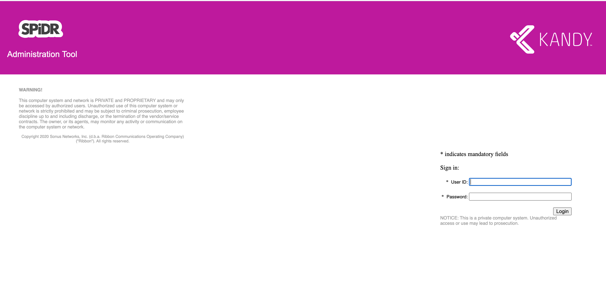
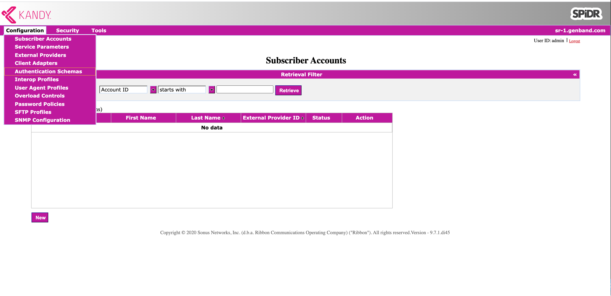
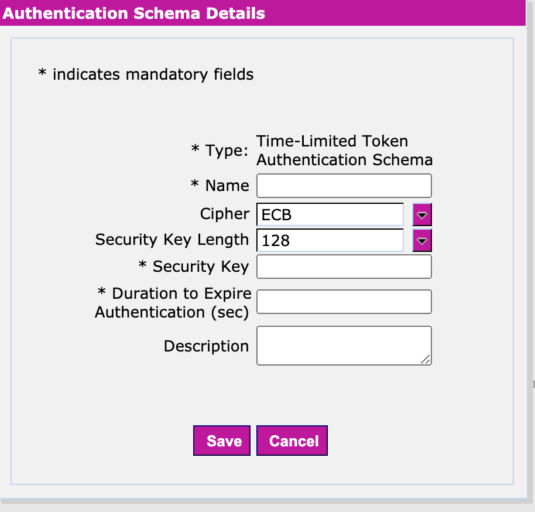

# Generating Tokens

This page explains the use case of making anonymous calls using token based mode. Otherwise, the steps outlined in this page, can be skipped.

## Obtaining Key & Token Realm Values from Administrator

In order to generate authentication tokens, you need to obtain the key & realm token.
The key & realm token values are not specific for a user/caller, but rather for a server side application.

The administrator should go through the following steps to generate them:

- Login to Kandy Link Admin Portal site with administrator priviledges. A typical front end UI looks like this.



- Once logged in, select _Configurations_ -> _Authentication Schemas_ menu.



- This will bring the folowing pop-up where administrator needs to fill in at least the mandatory fields seen below.



The 'Name' field really refers to realm token and 'Security Key' is the key user needs to know as well. Optionally, you can specify for how long this key is valid.

Note that current support (for Time-Limited tokens) includes both 128-bit & 256-bit keys.

ECB cipher uses 128-bit keys (which translates to a 16 alpha/numeric value that needs to be entered in the 'Security Key' text field).

CBC cipher uses 256-bit keys (which translates to a 32 alpha/numeric value for the 'Security Key')

## Using the Obtained Key Value to Generate the 3 Tokens

The tokens are generated by using this key information in conjuction with a timestamp (typically current date & time when call is about to be triggered).

An example on how to generate such tokens is to make use of the crypto library, as shown below.
This code would typically run on server side:

1. Import the `crypto` library:

```javascript
const crypto = require('crypto')
```

2. Define the addresses for caller & callee:

```javascript
const account = 'mycaller@cpaasapi.nds.genband.com'
const caller = 'sip:' + account
const callee = 'sip:mycallee@cpaasapi.nds.genband.com'
```

You will need to modify the full code example we provide and replace 'mycaller' & 'mycallee' with the actual user IDs involved in the anonymous call. These are the same user IDs used in [Anonymous Calls Quickstart](Anonymous%20Calls).

3. Define the key you got from the previous section and generate a current timestamp:

```javascript
const key = 'key value obtained from admin'
const timestamp = Date.now()
```

You will also need to modify the code example provided by replacing the 'key value obtained from admin' with the actual value, or simply provide that value as part of the URL request (see below).

4. Finally, generate the 3 tokens based on all the info defined above.

```javascript
const accountToken = createToken(account, key, timestamp)
const fromToken = createToken(caller, key, timestamp)
const toToken = createToken(callee, key, timestamp)
```

The `createToken` function makes use of [Node.js crypto library](https://nodejs.org/api/crypto.html#crypto_crypto) to encrypt all three input parameters.

It first creates two buffers based on the three input parameters. In doing so, the three input strings are converted into bytes, using UTF8 (as default character encoding).

```javascript
function createToken (user, key, timestamp) {
  const keyBuffer = Buffer.from(key)
  const userInfo = user + ';' + timestamp
  const textBuffer = Buffer.from(userInfo)
```

It then creates and returns a Cipher object, based on the given algorithm, key and initialization vector. The algorithm (used to during encryption) is identified by a specific name, in this case 'aes-128-ecb' denoting the AES (Advanced Encryption Standard) encryption specification and 128 as the block size (in bits). More details can be found [here](https://en.wikipedia.org/wiki/Advanced_Encryption_Standard)

If your administrator configured a key length of 256 bits, then the supported algorithm that needs to be passed in is 'aes-256-cbc'.

```javascript
// Create an initialization vector
const ivBuffer = Buffer.from('')
// Create 'crypter' object based on algorithm aes-128-ecb or aes-256-cbc
const crypter = crypto.createCipheriv('aes-128-ecb', keyBuffer, ivBuffer)
```

Once we generated our Cipher object, we use its `update` & `final` functions to produce the encrypted data. The encrypted data is generated based on our input `textBuffer` whose encoding is `buffer`. The encrypted data will have the output encoded as `hex`. Calling `final` wraps up any further encoding that can be done on this Cipher object. The encrypted data is then stored in `chunks` array of bytes.

```javascript
const chunks = []
chunks.push(crypter.update(textBuffer, 'buffer', 'hex'))
chunks.push(crypter.final('hex'))
```

Finally, we produce a buffer using HEX character encoding and thus `createToken` function returns its stringified contents to caller.

```javascript
  const encryptedBuffer = Buffer.from(chunks.join(''), 'hex')
  return encryptedBuffer.toString('hex')
}
```

Then you can print all three encrypted tokens for the user to see them:

```javascript
console.log('    accountToken: ', accountToken)
console.log('    toToken: ', toToken)
console.log('    fromToken: ', fromToken)
```

Notice that the token realm value is not used (yet) at this point in time. It will be used later on, when the actual API call is made. See the [Anonymous Calls Quickstart](Anonymous%20Calls).

