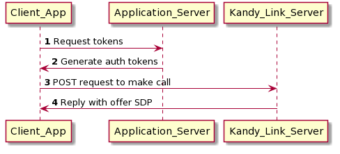

# Get Started

In this quickstart, we will help you dip your toes in before you dive in. This guide will help you get started with making Anonymous Calls using the $KANDY$ CallMe Javascript SDK (referred to as Anonymous Call SDK throughout the tutorial).

## Getting the SDK

The Anonymous Call SDK is available on NPM and can be added to your project using either npm or yarn.

**NPM**

```
  > npm install @kandy-io/callme-sdk
```

**Yarn**

```
  > yarn add @kandy-io/callme-sdk
```

## Using the SDK

To begin, you will need to include the javascript library in your application. The library can be included as a Universal Module Definition (UMD) module by using a `<script>` tag or bundled with your application as a CommonJS module.

#### As a Script

The library will expose the `Kandy` object to global scope. The `Kandy.create` function is used to create an instance of the SDK, as well as to configure that instance.

```html
<!-- HTML -->

<!-- Load the library. -->
<script src="path/to/kandy.js"></script>

<script type="text/javascript">
  // Instantiate the library.
  const client = Kandy.create(configs)

  // Use the library.
  client.on( ... )
  ...
</script>
```

#### As a Bundle

Different module bundlers can be used to bundle the library with your application. In your application, you simply need to import the library to be able to make use of it.

```javascript
// ES6 import or...
import { create } from '@kandy-io/callme-sdk'
// CommonJS module.
var create = require('@kandy-io/callme-sdk').create

// Instantiate the library.
const client = create(configs)

// Use the library.
client.on( ... )
```

After you've created your instance of the SDK, you can begin playing around with it to learn its functionality and see how it fits in your application. The API reference documentation will help to explain the details of the available features.

The examples that follow will assume that you are using bundling and that the Kandy library is accessible from the <i>/node_modules/<i> folder and therefore required to be accessed by the name `@kandy-io/callme-sdk` only.

## Configurations

When instantiating the library, there are many configurations that will help to customize behavior to what best serve your application's needs. This can be done by providing a configuration object to the library factory as shown below.

```javascript
// Instantiate the SDK.
import { create } from '@kandy-io/callme-sdk'
const client = create({
  // Required: Server connection configs.
  authentication: {
    subscription: {
      server: '$SUBSCRIPTIONFQDN$'
    }
  },
  logs: {
    // Customize logging options.
  }
  // Other feature configs.
  // ...
})
```

To learn more about configuring the Anonymous Call SDK, please see the [Configuration Quickstart](configurations).

## Anonymous Call Support

This SDK supports two ways of making an anonymous call:

- Token based mode
- Regular anonymous mode

### Token Based Mode

This mode is used to obfuscate identities, as one does not want identities to be seen by anybody who inspects the HTML / Javascript code.

This mode uses three generated tokens, namely:

- Account token
- Caller token (also known as 'From' token)
- Callee token (also known as 'To' token)

The tokens are generated based on a secret _key_ which is generated by the administrator and pre-shared with the user making the anonymous call.

The key is a string entity used to obfuscate the true identity of caller (as well as its time validity) in those generated tokens. Once tokens have been generated, they are valid for a short period of time (in seconds) during which user can make anonymous calls.

In addition to pre-sharing a key value, the administrator will also share a _schema_ (also known as _token realm_). Similar to key, the token realm is a string entity whose value is used in requesting a subscription to 'call' services. – see the [Anonymous Calls Quickstart](Anonymous%20Calls).

In addition to pre-sharing _key_ & _token realm_, the user needs to send a request to administrator to configure anonymous mode on Kandy Link server. This involves setting up certain destination accounts that can be called anonymously.

More on how to generate those tokens & the steps needed for server side configuration, can be found at [Generating Tokens Quickstart](Generating%20Tokens)

#### Pros

- Token-based Anonymous calling is more secure than Regular anonymous mode because it implies the use of a known key that caller uses.
- Also the token generated is based on some timestamp (e.g. current time) and therefore it's use is limited in time (as tokens expire). Therefore it is harder to trigger a Denial of Service (DoS) on server side.
- Since the token is generated by an application's server, it adds the ability for an application to also limit anonymous calls to it's own parameters:
  - A user can only make an anonymous call once logged in to the website.
  - A user can only make an anonymous call during a certain time of day (e.g. work hours)
  - A limit on the number of calls or frequency of the calls can be imposed by the application.

#### Cons

- Caller needs to go through an extra step of generating those three tokens as well as obtaining the secret _key_ beforehand, from administrator.

### Regular Anonymous Mode

In this mode, the caller can simply call the SDK API without the need for generating tokens. Only the callee address needs to be provided with no encryption.

Regular mode is more often used calls need to be made to well disclosed destinations (i.e., more globally available), such as: helpdesk@rbbn.com or support@rbbn.com

#### Pros

- Regular mode requires no tokens; thus, the application logic that the developer needs to write will be simpler.

#### Cons

- Not as secure as the first mode as nothing is encrypted in terms of identities and/or time of use.

## Basic Architecture

For using the Anonymous Call SDK, you will need more components than just a client, so the diagram below shows what will be needed in the end.
This diagram shows the initial message interaction between the three entities involved when making an anonymous call.



- Client Application (which developer needs to write by making use of our 4.x CallMe SDK)
- This application sends an initial request to an application server to obtain the tokens.
- It then sends a REST request to Kandy Link server to make an anonymous call.

- Application/Web server
- Responsible for generating the tokens upon Client's request

- Kandy Link server
- Accepts anonymous calls from Client, forwards request to callee and replies back to Client with an SDP offer.

